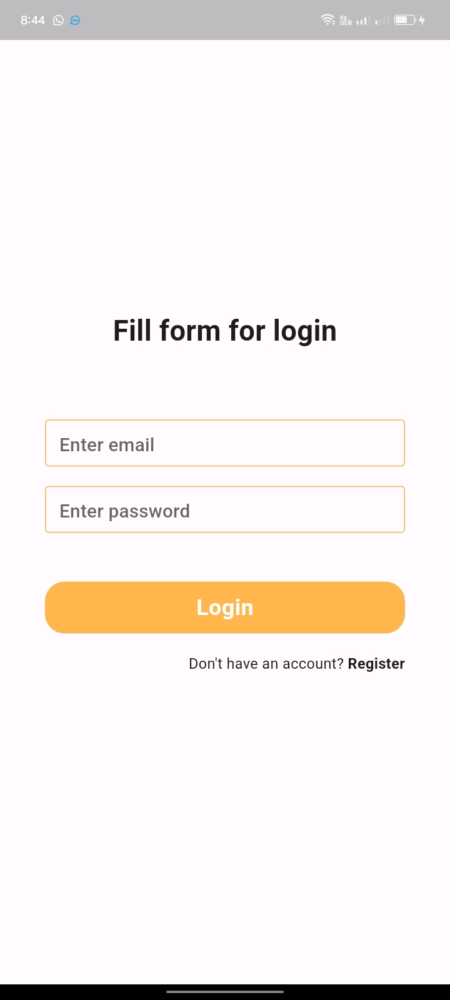
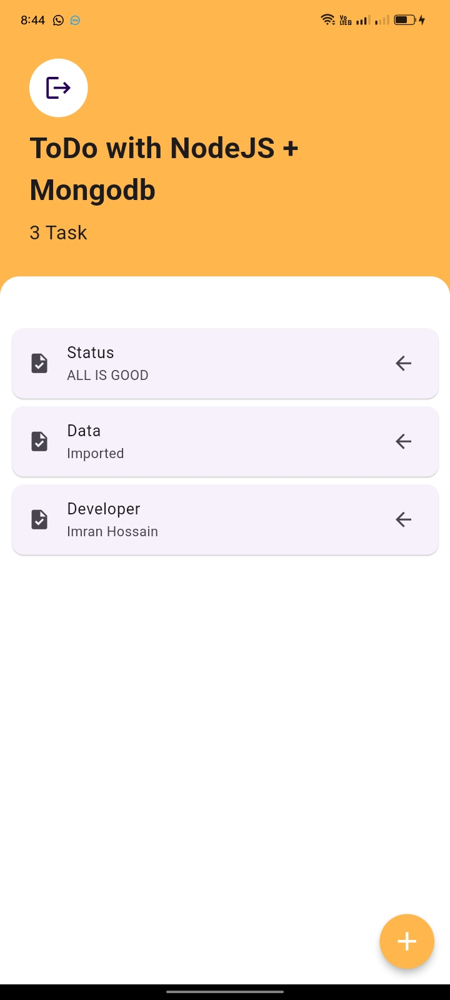
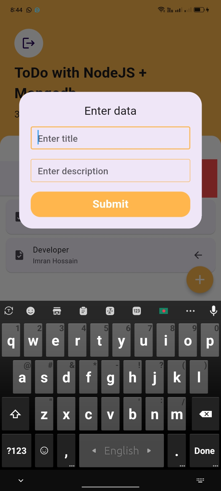
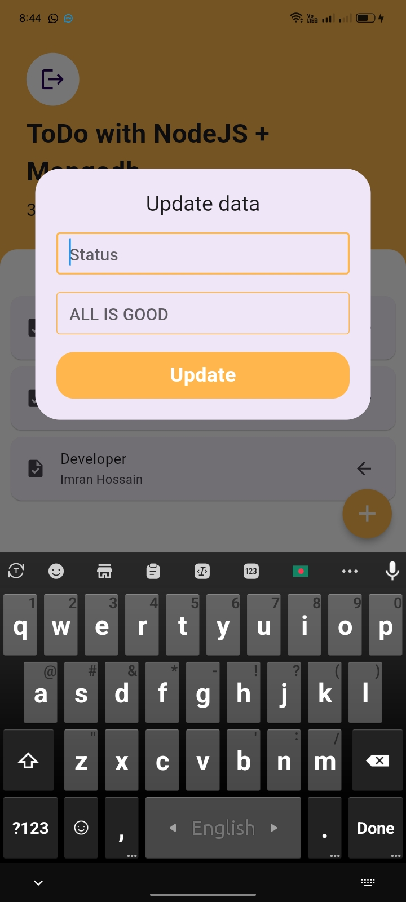
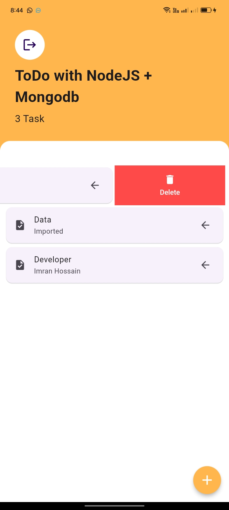

# This is a Todo app via Node.js as back-end and Mongo as database

<h2 style="color:red">Here I used</h2>

<li style="color:gold">Provider</li>
<li style="color:gold">
    Mongo Database
        <ul style="color:cyan">Login</ul>
        <ul style="color:cyan">Signup with gmail</ul>
        <ul style="color:cyan">CRUD operation</ul>
</li>
<li style="color:gold">
    Back-end by node.js(in github but private)
    <ul style="color:cyan">CRUD Api</ul>
</li>
<li style="color:gold">Slidable</li>

<h3>Login Screen</h3>

<h3>Register Screen</h3>

<h3>Home Screen</h3>

<h3>Insert Quiry</h3>

<h3>Update Quiry</h3>

<h3>Delete Quiry</h3>
